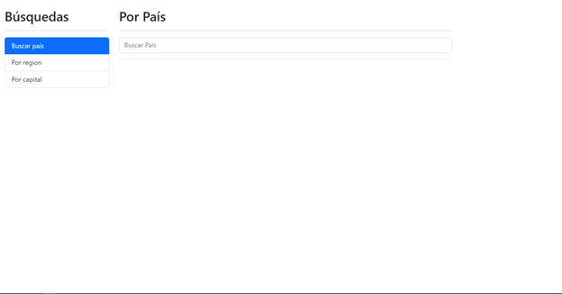

# CountriesApp

This project is a simple SPA app to display countries information and search it by name, capital or region.

## General info

Builded with Angular 14.2.3 and bootstrap 5.2.1 this project was created to improve my skills in Angular and Typescript. Also to learn how Angular works as a framework and how to use it to build a SPA app, this include the use of components, services, routing, etc.

## Technologies

Project is created with:

- HTML 5
- [Bootstrap 5.2.1](https://getbootstrap.com/docs/5.0/getting-started/introduction/)
- [Typescript](https://www.typescriptlang.org/)
- [Angular 14.2.3](https://angular.io/)

## Setup

### Prerequisites

To run this project, you need to have installed [Node.js](https://nodejs.org/en/) and [Angular CLI](https://angular.io/cli) in your computer.

### Installing

To install this project, follow these steps:

1. Clone the repository

   ```sh
   git clone git@github.com:AngelCruzL/ng-countries.git
   ```

2. Install dependencies

   ```sh
   npm install
   ```

3. Run the project

   ```sh
   ng serve -o
   ```

Automatically the browser will open the app in the port 4200and you will see the app running.


